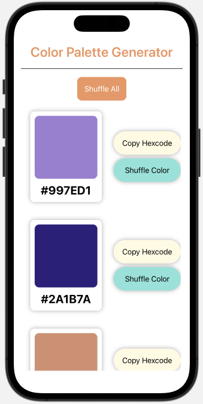
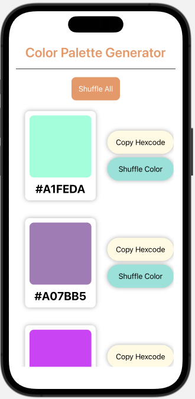
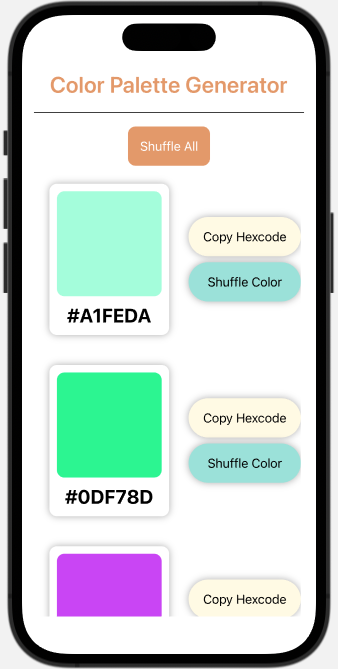
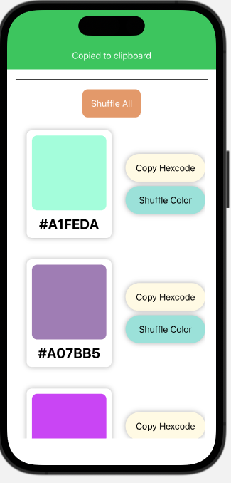

# colorPaletteGenIOS

|  Check this out!    | Shuffle all the colors| Or just shuffle one color | Copy the hexcode to paste elsewhere |
| --------------- | --------------- | --------------- | --------------- |
|  |  |  |  |
